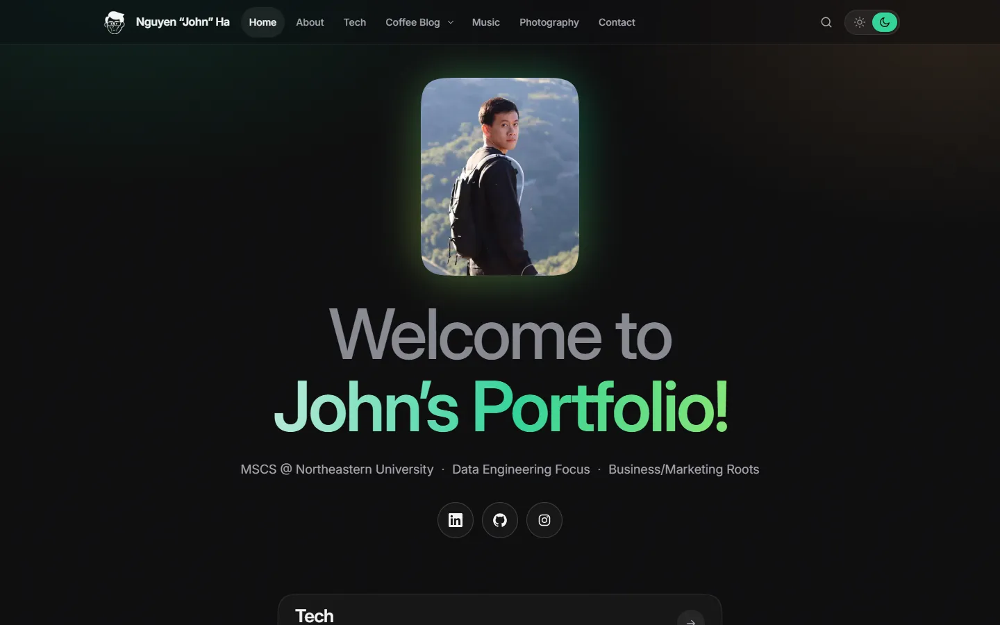
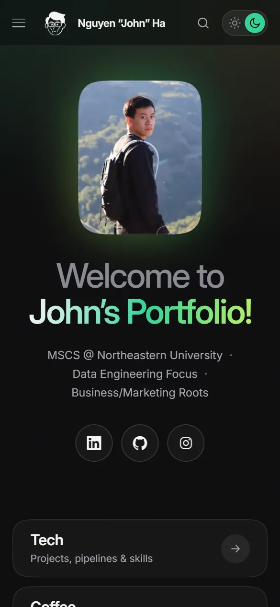
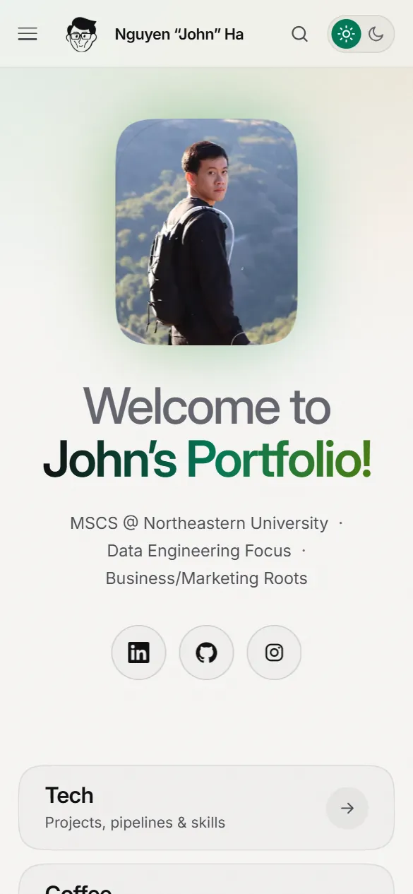
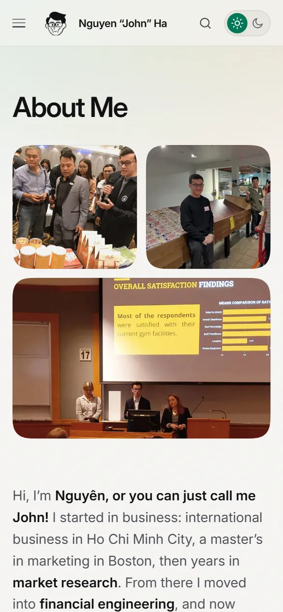
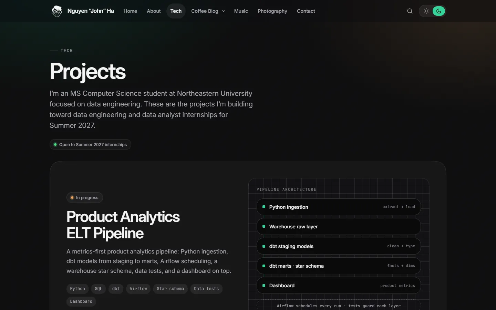
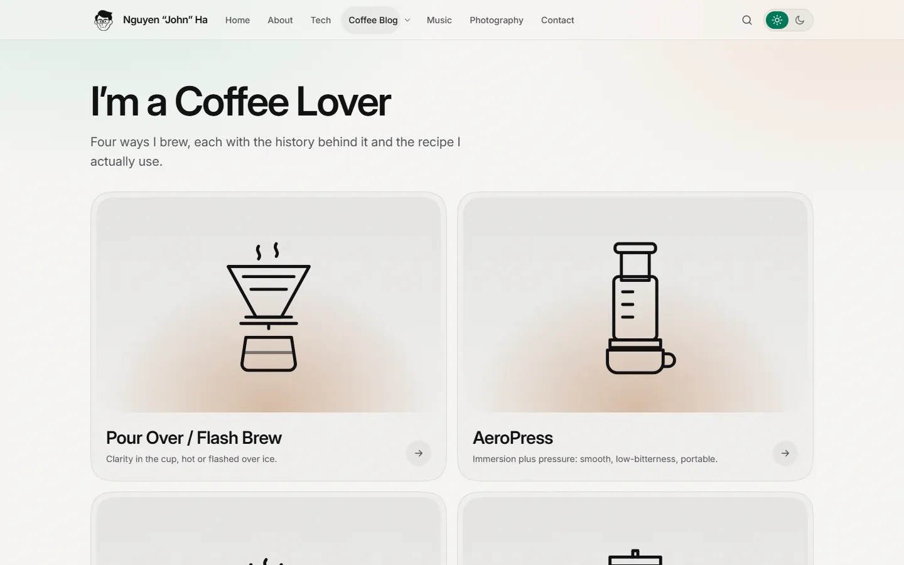

<div align="center">


# Nguyen “John” Ha · Portfolio

**MSCS @ Northeastern University · Data Engineering Focus · Business/Marketing Roots**

[**johnha.info**](https://johnha.info) · [LinkedIn](https://www.linkedin.com/in/nguyenha912/) · [GitHub](https://github.com/johnha912) · [Email](mailto:johnha0912@gmail.com)

<sub>Open to data engineering and data analyst internships for Summer 2027.</sub>

</div>

<br>

<p align="center">
  
</p>

<table>
  <tr>
    <td width="33%"></td>
    <td width="33%"></td>
    <td width="33%"></td>
  </tr>
</table>

<p align="center">
  
  
</p>

## What's inside

| Page | Highlights |
|---|---|
| **Home** | Centered portrait hero, social row, and the five-button section stack (Tech, Coffee, Music, Photography, Contact) |
| **About** | Photo collage, career path (marketing & market research → financial engineering → computer science & data), education timeline, certificates |
| **Tech** | Featured in-progress projects with architecture diagrams: *Product Analytics ELT Pipeline* and *OmniRAG Data Platform Upgrade*; earlier work (JOIN-order DP optimizer, OmniRAG, the jivec C compiler); toolbox |
| **Coffee Blog** | Brew guides for pour over / flash brew, AeroPress, espresso, and Vietnamese phin, each with a recipe profile, steps, credited photos, and references; the espresso guide has an interactive TDS brewing control chart |
| **Music** | Fun Mix Radio #3, #2, #1 with SoundCloud players that load only when you press play |
| **Contact** | One-click email plus LinkedIn, GitHub, and Instagram |

## Site structure

```
johnha.info
├── /                              Home: portrait hero, social row, five-button section stack
├── /about/                        About Me: photo collage, career path, education, certificates
├── /tech/                         Projects: featured work, earlier work, toolbox
├── /coffee-blog/                  Coffee Blog: 2×2 grid of brew guides
│   ├── /pour-over-flash-brew/
│   ├── /aeropress/
│   ├── /espresso/                 includes the interactive TDS brewing control chart
│   └── /vietnamese-phin/
├── /music/                        Music: Fun Mix Radio tracks, click-to-load SoundCloud players
├── /contact/                      Email button with copy-address, social links
├── /privacy/                      Analytics and cookie policy
├── /home/                         Redirects to /
└── /404.html                      Custom not-found page

External section: Photography → Instagram
```

Every page shares the same header and footer:

- **Header nav:** Home · About · Tech · Coffee Blog ▾ (the four brew guides) · Music · Photography ↗ · Contact, plus search and the theme menu. Below 960px the links fold into a full-screen menu, where the brew guides collapse behind a chevron.
- **Footer:** Back to top, ©, Privacy, and Cookie settings.

## Built with

- **Plain HTML, CSS, and vanilla JS.** No framework and no build step; the home page loads in about 220 KB.
- **Design tokens** for dark and light themes, with a sun/moon sliding **Dark / Light** switch (Dark by default).
- **Inter** variable font, self-hosted, so every phone and PC renders the same type.
- **Squircle photo frames** (`corner-shape: squircle`) with rounded-corner fallback, film grain, soft aurora glow, and a sticky glass nav.
- **Command-palette search** (<kbd>Ctrl</kbd>/<kbd>⌘</kbd> + <kbd>K</kbd> or <kbd>/</kbd>), scroll reveals, and cross-page view transitions. All motion respects `prefers-reduced-motion`.
- Responsive WebP images with `srcset`, Open Graph cards, JSON-LD, sitemap, and a custom 404.
- Google Analytics 4 behind a cookie consent banner (Consent Mode v2: nothing is stored until the visitor accepts), plus a privacy page.

## Repository layout

```
site/                  Published site (the only folder deployed)
  <page>/index.html    One folder per page (see Site structure)
  assets/css/          site.css: design tokens and all components
  assets/js/           site.js (theme, menu, search, consent), espresso-chart.js
  assets/fonts/        Self-hosted Inter and JetBrains Mono (WOFF2)
  assets/img/          Responsive WebP images, icons, favicons
  assets/vendor/       Plotly basic bundle (espresso chart only)
  sitemap.xml, robots.txt, CNAME, site.webmanifest
docs/                  Brief, design system, status, tooling, maintenance, domain guide
.claude/agents/        Claude Code agent team (orchestrator + specialists)
.claude/skills/        Vetted design skills (see docs/TOOLS.md)
.github/workflows/     GitHub Pages deploy + monthly link check
```

## Run locally

```bash
python -m http.server 8765 --directory site
# then open http://127.0.0.1:8765
```

## Deploy

Every push to `main` deploys `site/` to GitHub Pages through GitHub Actions (`.github/workflows/deploy.yml`). The custom domain switch from Google Sites is documented in [`docs/DOMAIN-MIGRATION.md`](docs/DOMAIN-MIGRATION.md); upkeep notes are in [`docs/MAINTENANCE.md`](docs/MAINTENANCE.md).

## Credits

Coffee photos are freely licensed images from Wikimedia Commons, credited under each photo and listed in [`docs/IMAGE-CREDITS.md`](docs/IMAGE-CREDITS.md). Chart rendering uses [Plotly.js](https://plotly.com/javascript/) (MIT). Design skills vendored under `.claude/skills/` are MIT-licensed: [taste-skill](https://github.com/Leonxlnx/taste-skill) by Leonxlnx and [UI UX Pro Max](https://github.com/nextlevelbuilder/ui-ux-pro-max-skill) by Next Level Builder. Fonts: [Inter](https://rsms.me/inter/) and [JetBrains Mono](https://www.jetbrains.com/lp/mono/) (SIL Open Font License).

© Nguyen “John” Ha. All rights reserved for photos and written content.
